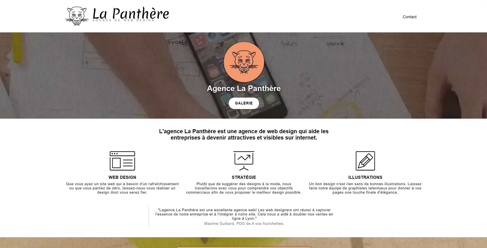
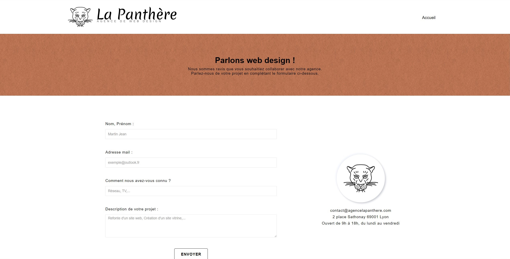

# Formation développeur web 


## 📎 Projet 4 : La Panthère


 

 

## Technologies :
- HTML
- CSS


## Tester le projet :

```terminal
git clone https://github.com/Cyril-Develop/LaPanthere.git
```
